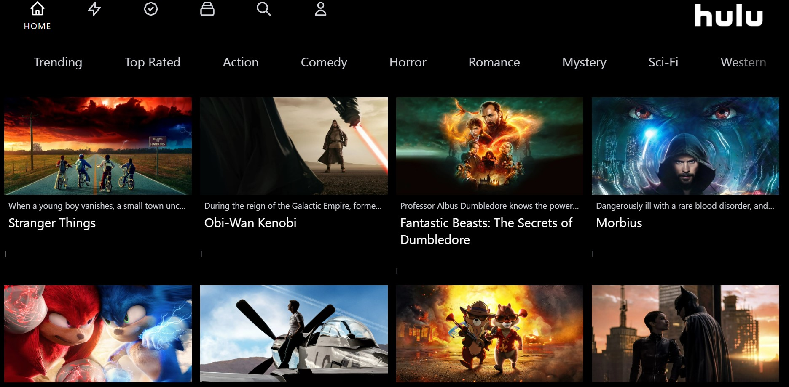
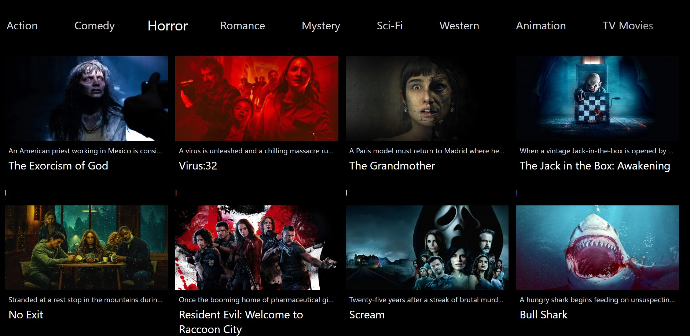

## Screenshots in Readme



## Getting Started

First, run the development server:

```bash
npm run dev
# or
yarn dev
```

Open [http://localhost:3000](http://localhost:3000) with your browser to see the result.

You can start editing the page by modifying `pages/index.js`. The page auto-updates as you edit the file.


## Learn More

To learn more about React.js, take a look at the following resources:

- [React.js Documentation](https://reactjs.org/docs) - learn about features and API.
- [Learn react.js](https://reactjs.org/learn) - an interactive tutorial.

Your feedback and contributions are welcome!
